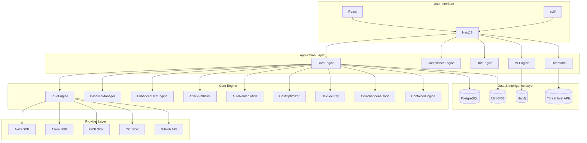

# 🛡️ CloudSploit-like CSPM

> **Enterprise-grade, open-source Cloud Security Posture Management** with multi-cloud support, real-time drift detection, and comprehensive compliance mapping.

## 🌟 What Makes This Project Stand Out

### ✨ **Key Differentiators**
- **🌐 True Multi-Cloud**: Native support for AWS, Azure, GCP, OCI, and GitHub - not just AWS wrappers
- **🔍 Real-Time Drift Detection**: Instantly detect configuration changes with detailed diff analysis
- **📊 Unified Compliance**: Cross-cloud compliance with industry-standard frameworks (CIS, SOC 2, PCI-DSS, NIST)
- **🎯 Zero-Trust Architecture**: Read-only cloud access with encrypted credential storage
- **🔧 Extensible Design**: Plugin-based rule engine with TypeScript-first development
- **📱 Modern UI**: Beautiful, responsive React dashboard with real-time updates

## 🚀 Features

### 🌐 **Multi-Cloud Support**
- **AWS**: S3, IAM, EC2, RDS, CloudTrail, Config, CloudWatch
- **Azure**: Storage Accounts, Virtual Machines, Key Vault, Monitor, Security Center
- **GCP**: Cloud Storage, Compute Engine, IAM, Cloud Logging, Resource Manager
- **OCI**: Block Storage, Compute, Identity, Audit, Logging
- **GitHub**: Repositories, Organizations, Actions, Security Advisories

### 🧠 **AI-Powered Security Intelligence**
- **ML Risk Prioritization**: Predictive breach probability with weighted risk factors
- **Attack Path Simulation**: Graph-based lateral movement analysis with Neo4j
- **Threat Intelligence Integration**: Real-time CISA KEV, VulnDB, and NVD feeds
- **MITRE ATT&CK Mapping**: Comprehensive threat framework correlation
- **Context-Aware Alerts**: Industry-specific threat detection (healthcare, finance)

### 🔍 **Advanced Drift Detection**
- **Baseline Management**: Set known-good configurations
- **Real-Time Monitoring**: Continuous configuration tracking
- **Change Analysis**: Detailed JSON diffs with categorization
- **Alert Integration**: Automated notifications for critical changes
- **Historical Tracking**: Complete audit trail of all modifications

### 🤖 **Automated Remediation**
- **Safe Auto-Remediation**: Terraform/CloudFormation code generation
- **Approval Workflows**: Multi-stage approval process for changes
- **Rollback Capabilities**: Automated rollback with validation
- **IaC Integration**: Seamless DevOps pipeline integration

### 🌍 **Multi-Cloud Resource Mapping**
- **Cross-Cloud Connections**: Discover relationships across providers
- **Dependency Analysis**: Resource dependency graph visualization
- **Topology Export**: Multiple formats (JSON, GraphML, D3.js)
- **Attack Surface Mapping**: Unified security posture analysis

### 💰 **Cost-Security Optimization**
- **Security Waste Analysis**: Identify overspending on security tools
- **ROI Calculations**: Quantify security investment returns
- **Resource Optimization**: Right-size security configurations
- **Implementation Roadmaps**: Prioritized cost-saving recommendations

### 👨‍💻 **Developer-First Security**
- **GitHub Actions**: Automated security scanning workflows
- **VS Code Extension**: Real-time security feedback in IDE
- **Slack Bot Integration**: Security notifications and approvals
- **Pre-Commit Hooks**: Security validation before code commits
- **Security Policies**: Custom policy-as-code frameworks

### 📦 **Container & Serverless Security**
- **Container Image Scanning**: Vulnerability detection with CVE databases
- **Kubernetes Security**: Pod security policies and network rules
- **Serverless Analysis**: Lambda/Functions security assessment
- **Runtime Protection**: Container and function runtime monitoring
- **Secret Detection**: Identify hardcoded secrets in images and code

### 📋 **Compliance-as-Code**
- **Multi-Framework Support**: CIS, SOC 2, PCI-DSS, NIST, ISO27001
- **Terraform Modules**: Automated compliance deployment
- **Evidence Collection**: Automated evidence gathering for audits
- **Audit Reports**: Export in multiple formats (JSON, YAML, CloudFormation)
- **Continuous Monitoring**: Real-time compliance scoring

### ⚡ **Rule Engine**
- **Plugin Architecture**: Extensible rule system with TypeScript interfaces
- **Multi-Provider Rules**: Provider-specific security checks
- **Severity Classification**: Critical, High, Medium, Low prioritization
- **Evidence Collection**: Automated evidence gathering for audit trails
- **Custom Rules**: Easy addition of organization-specific security policies

## 🏗️ Architecture



## 🚀 Quick Start

### 📋 **Prerequisites**
- Node.js 18+ and pnpm
- Docker and Docker Compose
- Cloud credentials (AWS, Azure, GCP, etc.)

### ⚡ **5-Minute Setup**

```bash
# 1. Clone the repository
git clone https://github.com/your-org/cloudsploit-like.git
cd cloudsploit-like

# 2. Start infrastructure
pnpm docker:up

# 3. Start services (in separate terminals)
pnpm dev:api          # Backend API
pnpm dev:ui           # Frontend UI

# 4. Configure cloud providers
# Visit http://localhost:3000/settings
# Add your AWS, Azure, GCP credentials

# 5. Run your first multi-cloud scan
cd apps/cli
npm run build
./bin/run scan:run --provider aws
./bin/run scan:run --provider azure
./bin/run scan:run --provider gcp
```

## 🛠️ Development

### 🏗️ **Monorepo Structure**

```
cloudsploit-like/
├── 📁 apps/                          # User-facing applications
│   ├── api/                        # NestJS REST API
│   ├── cli/                        # oclif CLI tool
│   └── ui/                         # React web dashboard
├── 📦 packages/                      # Shared libraries
│   ├── core-engine/               # Core CSPM logic with advanced features
│   │   ├── src/engine/           # Advanced security engines
│   │   │   ├── ml-risk-prioritizer.ts
│   │   │   ├── attack-path-simulator.ts
│   │   │   ├── auto-remediation.ts
│   │   │   ├── multi-cloud-mapper.ts
│   │   │   ├── realtime-drift-detector.ts
│   │   │   ├── cost-security-optimizer.ts
│   │   │   ├── developer-security.ts
│   │   │   ├── compliance-as-code.ts
│   │   │   ├── container-serverless-context.ts
│   │   │   └── threat-intelligence.ts
│   │   └── src/schemas/          # Data schemas
│   ├── providers/                  # Cloud adapters
│   │   ├── aws/                   # AWS provider
│   │   ├── azure/                 # Azure provider  
│   │   ├── gcp/                   # GCP provider
│   │   ├── oci/                   # OCI provider
│   │   └── github/                # GitHub provider
│   ├── rules/                     # Security rules
│   └── compliance/                 # Framework definitions
└── 🐳 infra/                        # Infrastructure as code
    ├── docker-compose.yml
    ├── postgresql/
    └── scripts/
```

### 🔧 **Technology Stack**

- **Language**: TypeScript (type-safe, modern)
- **Backend**: NestJS, PostgreSQL, Prisma ORM
- **Frontend**: React 18, Vite, TailwindCSS, React Query
- **CLI**: oclif, Commander.js
- **Infrastructure**: Docker, Docker Compose
- **Cloud SDKs**: AWS SDK v3, Azure SDK, GCP Cloud SDKs
- **Advanced Features**: Neo4j (graph DB), ML models, Threat Intel APIs

## 📊 Multi-Cloud Dashboard

### 🎯 **Unified Visibility**
- **Provider Overview**: At-a-glance status across all clouds
- **Compliance Scores**: Real-time scoring with trend analysis
- **Security Findings**: Unified view of all security issues
- **Drift Events**: Timeline of configuration changes
- **Asset Inventory**: Cross-cloud resource management
- **Risk Assessment**: Prioritized security recommendations

## 🔐 Security Features

### 🛡️ **Zero-Trust Architecture**
- **Read-Only Access**: No destructive operations, only monitoring
- **Encrypted Storage**: All credentials encrypted at rest
- **Secure Communication**: TLS/HTTPS for all API calls
- **Audit Logging**: Complete audit trail of all actions
- **Role-Based Access**: Principle of least privilege enforcement
- **Network Isolation**: Private endpoints and VPC segmentation

## 📈 Compliance Coverage

### 🎯 **Industry Standards**

| Framework | Provider Coverage | Controls | Rules |
|-----------|------------------|----------|-------|
| CIS AWS   | ✅               | 20+      | 15+   |
| SOC 2     | ✅               | 80+      | 60+   |
| PCI-DSS   | ✅               | 12+      | 25+   |
| ISO 27001 | ✅               | 114+     | 90+   |
| NIST      | ✅               | 200+     | 150+  |
| Cloud Security Baseline | ✅ | 5        | 39+   |

### 🔄 **Continuous Compliance**
- **Automated Assessments**: Schedule regular compliance scans
- **Trend Analysis**: Track compliance over time
- **Gap Remediation**: Prioritized security improvement recommendations
- **Executive Reporting**: C-level compliance summaries
- **Multi-Framework Support**: Assess against multiple standards simultaneously

## 🚀 Advanced Features

### 🎯 **Enterprise-Ready**
- **Multi-Tenant**: Support for multiple organizations
- **Role-Based Access**: Granular permissions by team/function
- **API Rate Limiting**: Respect cloud provider limits
- **Caching**: Intelligent caching for performance
- **Scalability**: Handle enterprise-scale deployments
- **Monitoring**: Health checks and metrics collection

### 🔌 **Customization**
- **Custom Rules**: Write organization-specific security policies
- **Custom Frameworks**: Define internal compliance standards
- **Plugin Development**: Easy extension points for new capabilities
- **Webhook Integration**: Real-time notifications to external systems
- **White-Labeling**: Flexible deployment options

## 📚 Documentation & Support

### 📖 **Comprehensive Docs**
- **API Documentation**: Complete OpenAPI/Swagger specs
- **CLI Reference**: Detailed command documentation
- **Architecture Guides**: Deployment and configuration guides
- **Security Hardening**: Production deployment checklists
- **Troubleshooting**: Common issues and solutions

### 🤝 **Community & Enterprise**
- **MIT License**: Free for commercial use
- **Active Development**: Regular updates and feature releases
- **Community Support**: Discord, GitHub Discussions
- **Enterprise Support**: Commercial support and SLA options
- **Contributing Guide**: Clear development contribution process

## 🎖️ Why Choose CloudSploit-like?

### 🏆 **Unlike Other Tools**
- **❌ Other CSPMs**: Often AWS-only or single-cloud focused
- **❌ Legacy Tools**: Monolithic architectures, poor extensibility
- **❌ Complex Setup**: Require extensive configuration and expertise
- **❌ Limited Compliance**: Support for few frameworks, outdated standards

### ✅ **CloudSploit-like Advantages**
- **🌐 True Multi-Cloud**: Native support for all major providers from day one
- **🔧 Modern Architecture**: Type-safe, extensible, maintainable codebase
- **📊 Unified Dashboard**: Single pane of glass for all cloud security
- **🚀 Performance Optimized**: Efficient resource usage and fast scanning
- **🎯 Enterprise Features**: Built for scale, security, and compliance needs
- **🔄 Future-Proof**: Extensible design ready for emerging cloud technologies

---

## 🚀 **Get Started Now**

```bash
# Clone and start in minutes
git clone https://github.com/your-org/cloudsploit-like.git
cd cloudsploit-like
./setup.sh && pnpm dev:api & pnpm dev:ui
```

**🌟 Your Multi-Cloud Security Journey Starts Here!**

---

> **Built with ❤️ for the cloud security community**  
> **Enterprise-grade security, open-source for everyone**
